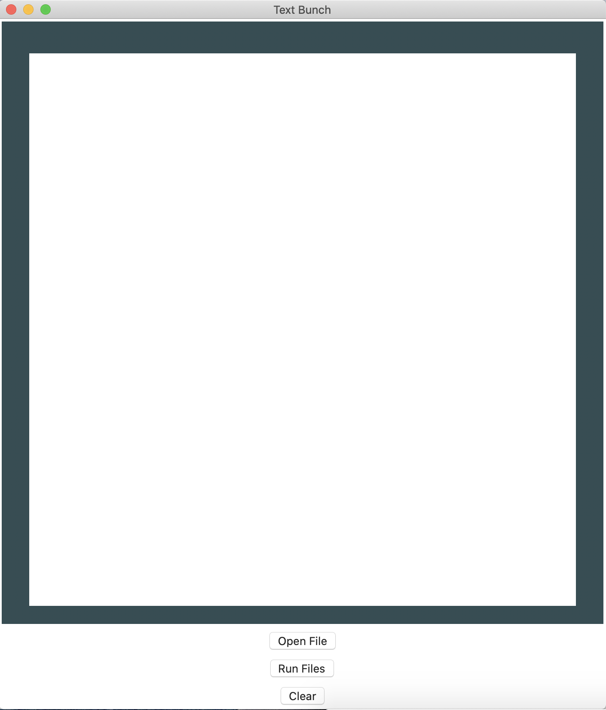

# Text-Bunch


This script will open many .txt at once and it also has a MacOS compatible GUI app.


## Installation
No extra installation is required expect Python


After installed required package, you can use it by
`python testapp.py`
If you are on MacOS you can also go to the releases section and download the .dmg file.


### How to run python script? 
#### Step 1.
After installing all the dependencies run testapp.py
#### Step 2.
The GUI window will open and navigate through the UI and select the files.
#### Step 3.
Click on open button and all files would open.


### App-Format



## Dependencies
```text
Python
TKinter
```

## NO FURTHER DEVELOPMENT
